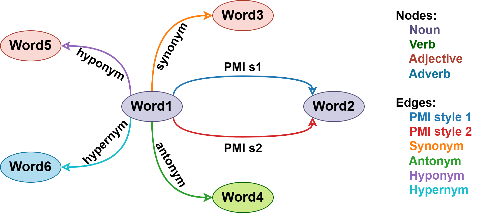
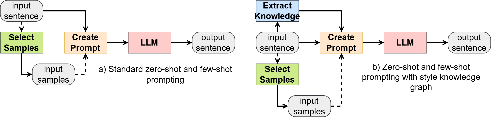

# Style Knowledge Graph: Augmenting Text Style Transfer with Knowledge Graphs

This is the official repository for the paper [Style Knowledge Graph: Augmenting Text Style 
Transfer with Knowledge Graphs](https://aclanthology.org/2025.genaik-1.13/).

Text style transfer is the task of modifying the stylistic attributes of a given text while 
preserving its original meaning. This task has also gained interest with the advent of large 
language models. Although knowledge graph augmentation has been explored in various tasks, its 
potential for enhancing text style transfer has received limited attention. This paper proposes 
a method to create a Style Knowledge Graph (SKG) to facilitate and improve text style transfer. 
The SKG captures words, their attributes, and relations in a particular style, that serves as a 
knowledge resource to augment text style transfer. We conduct baseline experiments to evaluate 
the effectiveness of the SKG for augmenting text style transfer by incorporating relevant parts 
from the SKG in the prompt. The preliminary results demonstrate its potential for enhancing 
content preservation and style transfer strength in text style transfer tasks, while the results 
on fluency indicate promising outcomes with some room for improvement. We hope that the proposed 
SKG and the initial experiments will inspire further research in the field. 

Read the full paper [here](https://aclanthology.org/2025.genaik-1.pdf#page=133). If you find this 
review useful, please kindly cite our paper:

```
@inproceedings{toshevska2025style,
  title={Style Knowledge Graph: Augmenting Text Style Transfer with Knowledge Graphs},
  author={Toshevska, Martina and Kalajdziski, Slobodan and Gievska, Sonja},
  booktitle={Proceedings of the Workshop on Generative AI and Knowledge Graphs (GenAIK)},
  pages={123--135},
  year={2025}
}
```

The main contributions of the paper are: 
- We propose a knowledge graph for text style transfer, which we refer to as a *Style 
  Knowledge Graph (SKG)*. 
- We evaluate the effectiveness of augmenting text style transfer with SKG via prompting.
- We analyze the influence of various parts of the SKG on the text style transfer task.

To get access to the created style knowledge graphs, feel free to contact the authors via email 
```martina.toshevska@finki.ukim.mk```.

A visual representation of the proposed approach is shown in the following figure:


The architecture of the proposed prompting methods is shown in the following figure:

